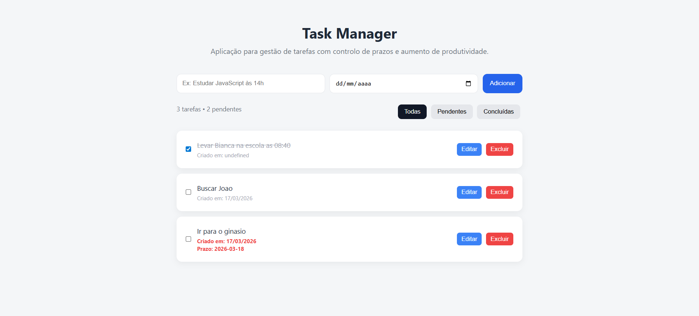

# 🧠 Task Manager

Aplicação web para gestão de tarefas com foco em organização, produtividade e controlo de prazos.

---

## 🚀 Demonstração

🔗 Projeto online:  
https://douglasestevam1984.github.io/task-manager/

💻 Repositório:  
https://github.com/douglasestevam1984/task-manager

---

## 📸 Preview



---

## ⚙️ Funcionalidades

✔ Adicionar tarefas  
✔ Editar tarefas  
✔ Marcar como concluída  
✔ Excluir tarefas com confirmação  
✔ Filtros (todas / pendentes / concluídas)  
✔ Contador de tarefas  
✔ Data de criação automática  
✔ Definição de prazo (deadline)  
✔ Destaque de tarefas atrasadas  
✔ Persistência de dados com LocalStorage

---

## 🧪 Tecnologias utilizadas

- HTML5
- CSS3
- JavaScript (ES6)
- LocalStorage

---

## 📚 Aprendizados

Neste projeto foram aplicados conceitos fundamentais de desenvolvimento frontend:

- Manipulação do DOM
- Eventos e formulários
- Estruturação de dados (arrays e objetos)
- Métodos como `map`, `filter`
- Persistência de dados no navegador
- Organização e separação de responsabilidades no código

---

## ▶️ Como executar o projeto

1. Clonar o repositório:

```bash
git clone https://github.com/douglasestevam1984/task-manager.git
```
